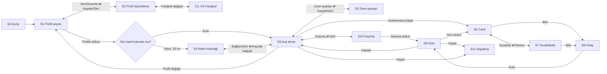

# Ürün şartnamesi

Görsel referans: `design/` klasöründeki `.dc.html` dosyaları (claude.ai Design kanvasından dışa aktarıldı).
Her ekran 800×480 CSS px. Dosyalar tasarım bileşeni formatında; düz HTML olarak birebir çalışmaz,
**yerleşim, metin, renk ve ölçü referansı** olarak oku. Canlı kanvas: https://claude.ai/artifact/CCi2oNBtfniyqyGb4KG5rk

## 1. Amaç
Kullanıcı PT'siyle antrenman yaparken göğüs bandı ya da saatten gelen nabzı, aktif zone'u,
her zone'da geçen süreyi, toplam süreyi ve ortam sıcaklığı/nemini büyük ve uzaktan okunur biçimde gösterir.

## 2. Ekranlar

| Kod | Ekran | Tasarım dosyası | Durum |
|---|---|---|---|
| S0 | Açılış | — (mockup yok) | Logo, "Hazırlanıyor…", arka planda Garmin eşitleme ve bant arama |
| S1 | Profil seçimi | `Profiles.dc.html` | Fotoğraflı kartlar, son kullanan önde, Konuk, Yeni profil, Düzenle |
| S2 | Profil düzenleme | `ProfileEdit.dc.html` | Ad, yaş, boy, kilo, fotoğraf; maks. nabız canlı hesaplanır |
| S3 | Ana ekran | — (mockup yok; tasarım dilinden türet, önce taslak göster) | Aktif profil, bağlı kaynak, anlık nabız önizleme, menü |
| S4 | Nabız kaynağı | `Pair.dc.html` | BLE tarama listesi, Bağlan, Yeniden tara |
| S5 | Zone ayarları | `Settings.dc.html` | Kaynak: Yaşa göre / Garmin / Elle |
| S6 | Canlı antrenman | `Main.dc.html` | Nabız + atan kalp, profil fotoğrafı + zone halkası, zone kartları |
| S7 | Duraklatıldı | — | Süre durur; Devam / Bitir |
| S8 | Bitirme onayı | — | Evet, bitir / Vazgeç (modal) |
| S9 | Seans özeti | `Summary.dc.html` | Kaydet / Yeni seans / Kapat |
| S10 | Geçmiş seanslar | — | Aktif profilin seans listesi → S9 salt okunur |
| S11 | Kapatma onayı | — | Kapat / Vazgeç → güvenli kapanış, "Fişi çekebilirsin" |
| C1–C6 | Fotoğraf (cihaz) | `Photo`, `PhotoHotspot`, `PhotoStatus`, `PhotoPreview`, `UsbPick`, `UsbCrop` | Bkz. §6 |
| P1–P4 | Fotoğraf (telefon, 390 px) | `PhoneUpload`, `PhoneCrop`, `PhoneDone` | Bkz. §6 |

Genel akış: `PhotoFlow.dc.html` ve `Flow.dc.html` (şema). Özet:

## 3. Nabız kaynağı
- BLE Heart Rate Service. Ölçüm baytı: flags bit0 → 8/16 bit nabız; bit1-2 sensör teması;
  bit3 enerji alanı var; bit4 RR aralıkları var (1/1024 sn). RR'leri de kaydet.
- Pil: Battery Service 0x180F / 0x2A19, varsa göster.
- Yayındaki veri yalnızca nabız ve RR'dir; **zone bilgisi yayında yok**, zone'lar cihazda hesaplanır.
- Son bağlanan cihazın adresi profil bazında saklanır; açılışta 15 sn aranır.
- Bağlantı koparsa üstte turuncu şerit, otomatik yeniden bağlanma (üstel bekleme, en fazla 5 sn aralık).

## 4. Zone'lar
- 5 zone, isimler: Isınma, Kolay, Aerobik, Eşik, Maksimum.
- Varsayılan sınırlar maks. nabzın %50/60/70/80/90/100'ü. Alt sınır dahil, üst sınır hariç; Z5 üst sınır dahil.
  %50 altı "zone dışı" sayılır, süre Z1'e yazılmaz, ayrı tutulur.
- Kaynaklar (profil bazında):
  - **Yaşa göre** (varsayılan): maks. = round(208 − 0,7 × yaş) (Tanaka).
  - **Garmin**: `garminconnect.get_heart_rate_zones()`; hangi spor profili kullanılacağı ayarda seçilir.
    Wi-Fi varsa açılışta ve "Eşitle"de çekilir, SQLite'ta önbelleklenir.
  - **Elle**: maks./dinlenik nabız +/−; yöntem % maks. ya da nabız rezervi (Karvonen).
- Boy ve kilo zone hesabına girmez (ileride kalori için; o zaman cinsiyet alanı da gerekir).

## 5. Seans kuralları
- Sayaç "Antrenmana başla" ile başlar; duraklatma ve 3 sn'yi aşan sinyal kesintisi süreden ve zone'lardan düşülür.
- 1 Hz örnek: zaman, nabız, RR listesi, zone, sıcaklık, nem, bağlı mı.
- Özet: toplam süre, ort./tepe nabız, ort. sıcaklık ve nem, zone süreleri ve yüzdeleri.
- Atan kalp animasyonu gerçek nabız hızında (periyot = 60 / nabız sn); sinyal yokken durur.
- Profil halkası: maks. nabzın yüzdesi kadar dolu, zone renginde.

## 6. Profil ve fotoğraf
- Profil: ad, yaş, boy (cm), kilo (kg), fotoğraf, zone kaynağı ve parametreleri, son BLE cihazı, Garmin bağlı mı.
- Konuk profili: kaydedilmez, fotoğrafsız.
- Fotoğraf yolları:
  1. **Telefon (C1→P1→P2→C3→C4):** tek kullanımlık token'lı URL QR'ı; telefon sayfası fotoğrafı
     tarayıcıda daireye kırpar, 512×512 JPEG'e çevirir (HEIC, EXIF yönü ve konum burada çözülür), POST eder.
  2. **Cihazın kendi ağı (C2):** telefon ve cihaz aynı ağda değilse NetworkManager ile "PT-Ekran"
     hotspot'u, her açılışta rastgele şifre, Wi-Fi QR (`WIFI:T:WPA;S:...;P:...;;`). Hotspot açıkken
     internet yok; Garmin eşitlemesi bekler; iş bitince eski bağlantıya dön.
  3. **USB bellek (C5→C6):** JPG/PNG listele, cihazda kırp (sürükle, +/−, 90° döndür).
- C4'te "Kullan"a kadar eski fotoğraf korunur; profil kaydedilmezse yeni fotoğraf atılır.
- Hata durumları: süre doldu, dosya açılamadı, iptal sonrası gelen yükleme (reddet), telefonda ağ hatası.
- Fotoğraf yoksa baş harf avatarı.

## 7. Gizlilik
- Tüm veri yalnızca cihazda. Profil silinince fotoğraf, seanslar ve örnekler de silinir.
- Başka kişiler için kullanılacaksa profil oluştururken açık rıza onay kutusu (nabız sağlık verisidir).

## 8. Kapsam dışı (şimdilik)
Kalori, bulut senkronu, Suunto bulut API'si (zone vermiyor), birden fazla aynı anda bağlı bant.
